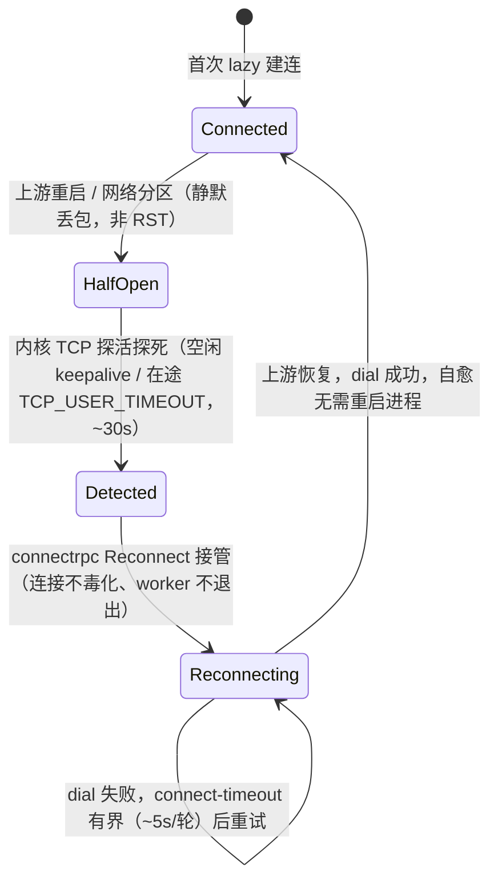

# fusion-rpc

ConnectRPC 集成层：服务挂载、认证中间件、上下文校验。

## Imports

```rust
use fusions::rpc::{
    // 服务挂载
    mount_rpc_services,
    // 东西向客户端 transport（自愈）
    ConnectTransport, TransportConfig, build_connect_transport, build_connect_transport_with,
    // 认证中间件
    AuthLayer, AuthConfig, ClaimMapping, ClaimSource, TrustedSubject,
    // 上下文校验
    ContextValidationLayer, ContextValidationConfig,
    // 配置
    RpcPlugin, RpcConfig, RpcClientConfig, RpcStartInfo, RpcSettings,
    // ConnectRPC re-exports
    ConnectError, ConnectRpcService, Context, ErrorCode,
};
```

## 服务挂载

### mount_rpc_services

将 ConnectRPC Router 挂载为 Axum fallback service，支持 Connect + gRPC + gRPC-Web 三协议。

```rust
use fusions::rpc::{mount_rpc_services, RpcConfig};
use connectrpc::Router as ConnectRouter;

let connect_router = ConnectRouter::new()
    .register(resident_service())
    .register(auth_service());

let axum_router = mount_rpc_services(axum_router, connect_router, &rpc_config);
```

> 当 `rpc_config.enable == false` 时，直接返回原 Router 不做挂载。

### RpcConfig

```toml
[fusion.rpc]
enable = true
path_prefix = "/"

[fusion.rpc.clients.resident_service]
addr = "http://localhost:9501"
plaintext = true
```

```rust
pub struct RpcConfig {
    pub enable: bool,
    pub path_prefix: String,           // 默认 "/"
    pub clients: HashMap<String, RpcClientConfig>,
}

pub struct RpcClientConfig {
    pub addr: String,
    pub plaintext: bool,               // 默认 true
}
```

## 东西向客户端 Transport（自愈）

服务间（东西向）调用 MUST 用生成的 `*ServiceClient<ConnectTransport>`，transport 由 fusion-rpc 工厂统一构造。工厂在 connectrpc 内置 `Reconnect` 状态机之上注入**内核层 TCP 探活**，使半开 / 黑洞连接在有界时间内被探测并自动重连——**无需重启进程**。

### API

```rust
use std::time::Duration;
use fusions::rpc::{ConnectTransport, TransportConfig, build_connect_transport, build_connect_transport_with};
use http::Uri;

// 默认自愈配置（开箱即用，drop-in 替换裸 lazy_plaintext）
let transport: ConnectTransport = build_connect_transport(uri);

// 显式调优
let transport = build_connect_transport_with(uri, &TransportConfig {
    connect_timeout: Some(Duration::from_secs(5)),
    tcp_keepalive: Some(Duration::from_secs(15)),
    tcp_keepalive_interval: Some(Duration::from_secs(15)),
    tcp_keepalive_retries: Some(3),
    tcp_user_timeout: Some(Duration::from_secs(30)),
    buffer_bound: 1024,
});

let client = AuthServiceClient::new(transport, client_config);
```

### 三层韧性（缺一不可）

| 机制 | 解决的半开场景 | 默认 |
|------|----------------|------|
| TCP keepalive（`KEEPIDLE` / `INTVL` / `CNT`） | **空闲**连接半开（无在途数据） | 15s / 15s / 3 |
| `TCP_USER_TIMEOUT` | **在途未确认写数据**半开（keepalive 探不到；否则卡 TCP 重传 ~924s） | 30s |
| connect-timeout | 重连 dial 打进黑洞（否则卡 OS SYN 重传 ~127s） | 5s |

无论空闲还是在途，半开都在 ~30s 内被探死 → connectrpc `Reconnect` 自动重连；重连 dial 受 connect-timeout 约束。默认值对齐 reqwest 0.13.4 验证过的 connector 默认。

### 自愈状态机



> `kill -9` / 优雅重启（GOAWAY / FIN）由内核发 RST，connectrpc `Reconnect` 本就即时处理；上图覆盖的是**静默半开**（丢包 / 分区），即必须靠内核 TCP 探活才能探到、否则卡 TCP 重传数分钟的场景。

### 约束

- **MUST 在 tokio runtime 上下文中调用** `build_connect_transport[_with]`——`.shared()` 内部 spawn worker；各服务在 `builder.run().await` 之后、客户端集中创建处（typed clients 聚合 struct）构造。
- **MUST 经工厂构造**；MUST NOT 在调用点自造裸 `Http2Connection::lazy_plaintext`（绕过自愈）或用 `HttpClient::plaintext()`（仅 HTTP/1.1）。
- `TCP_USER_TIMEOUT` 仅 linux / android / fuchsia 生效，工厂内部已按 target cfg 守卫；其它 target 自动退化为 keepalive + connect-timeout（字段保留无害，无需调用方分支）。

### 为什么 TCP 层而非 h2 PING

connectrpc 0.6 公开 API 中"自定义 connector"（配 connect-timeout / keepalive / user_timeout）与"自定义 h2 builder"（配 h2 PING）**互斥**，且 connectrpc 为第三方 crate 不可改；connect-timeout + user_timeout 必须走 connector，故半开探测由 TCP 层承担。TCP 探活是**内核层**、不受应用 CPU 停顿影响 → 不误杀健康的稀疏长流（如 voice bidi），并保活 NAT / LB 映射。bin↔bin 直连内网 h2c（无中间 L7 代理），TCP 层探活等效。仅当 bin 间出现吞 TCP keepalive 的 L7 代理时再议 h2 PING。

> 通用行为契约见 [service-dependency-contract.md §4.4](../../sdd/references/service-dependency-contract.md)；项目落地指针见 skill 目录同级的 `fusions.overlay.md`。

## AuthLayer — 认证中间件

解密 JWE token → 提取 JWT claims → 注入可信 HTTP headers。

### 核心概念

- **应用无关**: 所有应用配置通过 `AuthConfig` 注入，Layer 本身不包含领域逻辑
- **豁免机制**: 支持路径前缀豁免 (`exclude_paths`) 和 RPC service/method 豁免 (`exclude_rpcs`)
- **Claim 映射**: 灵活配置 JWT claim → HTTP header 的映射规则
- **非用户主体**: `TrustedSubject` extension + `trusted_subject_rpcs` 白名单（v0.3 新增，见下）

### AuthConfig

```rust
AuthConfig {
    // 路径前缀豁免
    exclude_paths: &["/health", "/config", "/version"],

    // 豁免但要保留调用方身份 header 的路径（默认空）
    preserve_identity_headers_for_paths: &[],

    // RPC (service, method) 豁免
    exclude_rpcs: &[
        ("example.auth.v1.AuthService", "Login"),
        ("example.auth.v1.AuthService", "RefreshToken"),
    ],

    // v0.3 新增：已验证的 TrustedSubject 可触达的 (service, method)。
    // 不是豁免 —— 无 token 且无 subject 的调用方照样 401。见下节。
    trusted_subject_rpcs: &[
        ("example.permission.v1.PermissionService", "ListUsersByPermission"),
    ],

    // JWT claim → HTTP header 映射（应用自定义）
    claim_mappings: &[
        ClaimMapping { header: "x-principal-id", source: ClaimSource::Subject },
        ClaimMapping { header: "x-scope-id",     source: ClaimSource::String("scope_id") },
        ClaimMapping { header: "x-level",        source: ClaimSource::I64("level") },
    ],

    // Authorization: Bearer 不存在时读取的 cookie 名称
    cookie_token_name: "access_token",

    error_code: "unauthenticated",
    error_message: "Invalid or expired token",
}
```

### ClaimSource

```rust
pub enum ClaimSource {
    Subject,                    // JWT "sub" claim → get_subject()
    String(&'static str),       // 自定义 string claim → get_str(name)
    I64(&'static str),          // 自定义 int claim → get_i64(name)
    StringOrI64(&'static str),  // 先尝试 string，fallback 到 int
}
```

### 使用方式

```rust
use fusions::rpc::{AuthLayer, AuthConfig};

let auth_layer = AuthLayer::new(security_setting, auth_config);

// 作为 Axum layer 使用
let router = Router::new()
    .fallback_service(connect_router.into_axum_service())
    .layer(auth_layer.into_middleware());
```

### 请求处理流程

```
1. 先移除 claim_mappings 中配置的身份 header（preserve_identity_headers_for_paths 命中时例外）
2. 检查路径豁免 → 豁免则放行
3. 检查 RPC 豁免 → 豁免则放行
4. 检查请求 extension 里的 TrustedSubject：命中 trusted_subject_rpcs 则注入其
   identity_headers 后放行；不命中则记 warn 并继续走下面的 bearer 流程（即 401）
5. 提取 Bearer token；若没有 Authorization，则读取 cookie_token_name 指定的 cookie
6. 解密 JWE → 失败返回 401
7. 按 claim_mappings 注入 headers → 放行
```

### TrustedSubject —— 非用户主体（v0.3 新增）

给「兄弟 bin 的后台任务」这类**没有用户 token** 的调用方开的窄口子：由应用自己的
**外层** layer 验证来源后，塞一个 `TrustedSubject` **request extension**。

```rust
pub struct TrustedSubject {
    /// 谁为这个主体背书，进日志 / 审计，如 "hylx-careos:system"
    pub principal: String,
    /// 向下游注入的身份 header，如 [("x-tenant-id", "3")]。
    /// 由验证方从它验过的东西推导，AuthLayer 绝不自己发明。
    pub identity_headers: Vec<(&'static str, String)>,
}
```

为什么是 extension 而不是 header：HTTP 客户端能伪造任意 header，但**设不了 request
extension**（进程内的类型化槽位）。`AuthLayer` 是最外层，若它以 header 形式到达，
就无法区分「我自己的内层 layer 注入的」与「调用方发来的」—— extension 从构造上消掉了
这个不可判定的情形。

fail-closed 的四条（改动这块前先读全）：

1. `AuthLayer` 仍会先剥掉所有 `claim_mappings` 里的身份 header —— 伪造的
   `x-tenant-id` 死在这一步，随后才注入 subject 自己的值。
2. subject 只能触达 `trusted_subject_rpcs` 白名单内的 RPC，白名单外一律 401。
3. 白名单**不使该 RPC 变成匿名可达**：既无 bearer 又无 subject 的调用方仍 401。
4. `identity_headers` 的值若不是合法 header 值（非 ASCII / 含控制符），**拒绝请求**
   而不是丢弃该 header —— 丢弃会让下游落进「无 tenant」分支。

`trusted_subject_rpcs` 与 `exclude_rpcs` 刻意分开：前者是「换一种身份来源」，
后者是「不需要身份」。合并两者会让匿名面被悄悄放大。

## ContextValidationLayer — 上下文校验

条件式 header 校验：当某个 header 匹配触发值时，要求另一个 header 必须存在。

### ContextValidationConfig

```rust
ContextValidationConfig {
    context_header: "x-context-mode",   // 读取的上下文 header
    trigger_value: "scoped",            // 触发校验的值
    require_header: "x-scope-id",       // 触发时必须存在的 header
    exclude_paths: &["/health"],
    exclude_rpcs: &[
        ("example.auth.v1.AuthService", "Login"),
        ("example.auth.v1.AuthService", "SelectContext"),
    ],
    reject_status: 403,                 // 拒绝状态码
    error_code: "permission_denied",
    error_message: "scoped context requires x-scope-id",
}
```

### 使用方式

```rust
use fusions::rpc::{ContextValidationLayer, ContextValidationConfig};

let validation_layer = ContextValidationLayer::new(config);

let router = Router::new()
    .layer(validation_layer.into_middleware());
```

### 校验逻辑

```
1. 检查路径豁免 → 豁免则放行
2. 检查 RPC 豁免 → 豁免则放行
3. 读取 context_header 值
4. 若值 == trigger_value → 检查 require_header 是否存在且非空
5. 不匹配 trigger → 放行（非触发场景不做校验）
```

## RpcPlugin

```rust
// 注册默认配置源
use fusions::rpc::RpcPlugin;

Application::builder()
    .add_plugin(RpcPlugin)
    .run()
    .await?;
```

## 典型组合使用

```rust
use fusions::rpc::{AuthLayer, AuthConfig, ClaimMapping, ClaimSource, ContextValidationLayer, ContextValidationConfig};

// 认证：解密 JWT → 注入 headers
let auth_layer = AuthLayer::new(security_setting, AuthConfig {
    exclude_paths: &["/health"],
    preserve_identity_headers_for_paths: &[],
    exclude_rpcs: &[("myapp.auth.v1.AuthService", "Login")],
    trusted_subject_rpcs: &[],
    claim_mappings: &[
        ClaimMapping { header: "x-principal-id", source: ClaimSource::Subject },
        ClaimMapping { header: "x-scope-id", source: ClaimSource::String("scope_id") },
        ClaimMapping { header: "x-level", source: ClaimSource::I64("level") },
    ],
    cookie_token_name: "access_token",
    error_code: "unauthenticated",
    error_message: "Invalid or expired token",
});

// 上下文校验：特定上下文必须携带对应 header
let validation_layer = ContextValidationLayer::new(ContextValidationConfig {
    context_header: "x-context-mode",
    trigger_value: "scoped",
    require_header: "x-scope-id",
    exclude_paths: &["/health"],
    exclude_rpcs: &[],
    reject_status: 403,
    error_code: "permission_denied",
    error_message: "scoped context requires x-scope-id",
});

// Layer 从下往上执行：先认证注入 headers，再校验 headers
let router = axum_router
    .layer(validation_layer.into_middleware())
    .layer(auth_layer.into_middleware());
```

## 错误转换

fusion-rpc 自身不直接抛 `DataError`（auth/validation middleware 内部直接构造 axum `Response`）。
`connectrpc::ConnectError` ↔ `DataError` **双向转换** 在 `fusions::error` 实现（feature = `rpc`）：

```rust
use fusions::DataError;
use connectrpc::{ConnectError, ErrorCode};

// service 层抛 DataError，handler 用 ? 转 ConnectError
async fn get_user(ctx: Context, req: ...) -> Result<(User, Context), ConnectError> {
    let svc = UserService::new(mm_from_ctx(&ctx)?.clone());
    let user = svc.get(req.id).await?;   // DataError → ConnectError
    Ok((user, ctx))
}

// 反方向：调用上游 RPC client，ConnectError 转回 DataError
let resp = client.get_user(...).await?;   // ConnectError → DataError
```

错误码映射表见 `fusions::error` 中的 `From<DataError> for ConnectError` 与 `From<ConnectError> for DataError`。

## Best Practices

1. **Layer 顺序**: AuthLayer 在下（先执行），ContextValidationLayer 在上（后执行）
2. **配置静态化**: AuthConfig / ContextValidationConfig 全部使用 `&'static` — 编译时确定，零运行时开销
3. **豁免完整**: Login、RefreshToken、SelectContext 等认证/上下文切换 RPC 必须加入豁免列表
4. **ClaimSource 选择**: 可能同时为 string 或 int 的字段使用 `StringOrI64`
5. **请求级 ctx 注入是应用职责**：fusions 不内置 ctx 注入中间件，因为可信 header 与 `AppContext` 字段的映射是应用特定的。推荐做法是应用 crate 自行实现一个 Tower `Layer`，置于 `AuthLayer` 之后、route 之前——该层读取 AuthLayer 注入的 trusted headers，构造 `AppContext`，clone base `ModelManager<AppContext>` + `with_ctx(...)`，然后把 ctx 与 scoped mm 一并写入 `request.extensions`。handler 通过 `Context::extensions`（ConnectRPC）或 `Parts::extensions`（Axum）取出 scoped mm 后 inline 构造 application service，**不要**从全局 DI 拿 service。

## Examples from Codebase

- `crates/fusion-rpc/src/auth_middleware.rs` - AuthLayer 实现 + 单元测试
- `crates/fusion-rpc/src/context_validation_middleware.rs` - ContextValidationLayer 实现 + 单元测试
- `crates/fusion-rpc/src/server.rs` - mount_rpc_services 实现
